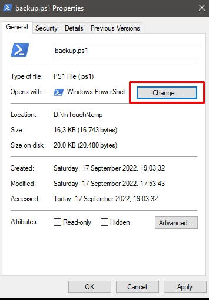
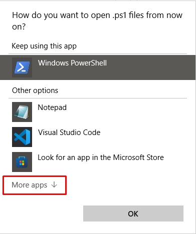
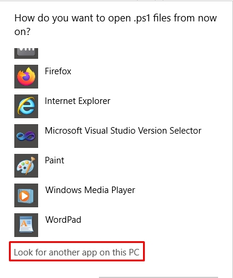
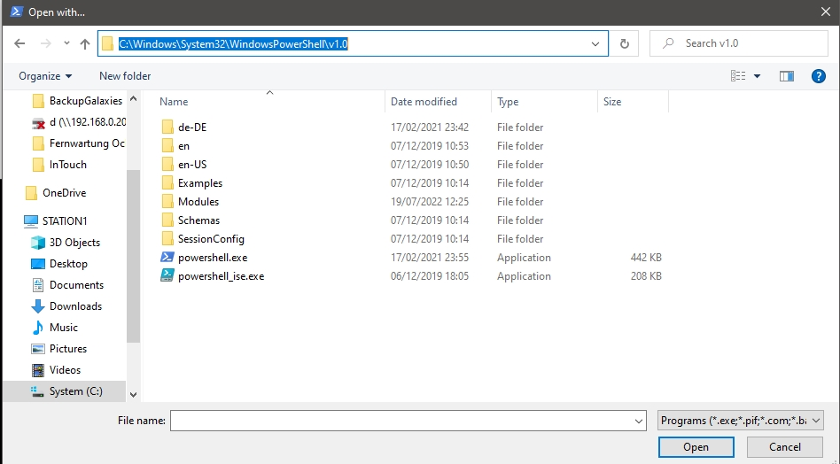

# Win-PS-Autobackuping README

<!-- markdownlint-disable MD033 -->
<!-- markdownlint-disable MD001 -->
<!-- markdownlint-disable MD013 -->
<!-- markdownlint-disable MD025 -->
<!-- markdownlint-disable MD026 -->

## Powershell Autobackuping Script for Windows. 

It uses Robocopy as standard, or Powershell, to copy all the files and folders in the script folder to one or more targets. The files can be compressed with 7zip (no robocopy there and no exclusions). Tere are some Settings you can change in the Script. 

If you have BackupSettings.json in the same folder as the Script, it will use the settings from there. If you don't have a BackupSettings.json, it will use the default settings from script.

## Function:

- Make backup of all Files in contained folder, except exclusions...
- WindowsCronRegister-backup.ps1 can register the Script as a Windows Task, so it will run every day at the time you set in the Script. 

---

## First steps

<br>

### allow powershell scripts execution

1. open powershell as administrator
2. run `Set-ExecutionPolicy RemoteSigned`

>optional: `Get-ExecutionPolicy -list |% {Set-ExecutionPolicy -scope $_.scope remotesigned -force -ErrorAction SilentlyContinue}`
>>this script set all scopes to remotesigned, but throws some errors, because not all scopes are available on all systems

<br>

### execute ps scripts on double click

1. clone this repo
2. right click on `backup.ps1` and select `Properties`
3. in the section `open with`, select `change`
  + 
4. scroll down and choose `More apps`
  + 
5. scroll down and choose `Look for another app on this PC`
  + 
6. paste `C:\Windows\System32\WindowsPowerShell\v1.0` in adressfield and press enter
  + 
7. select `PowerShell.exe` and choose open

---

## Settings

```json
{
    "global:debugTransScript":false,
    "global:debug":false,
    "UpdateVersion":130,
    "AdminRightsRequired":false,
    "AllowUpdate":true,
    "UpdateFromPath":"https://raw.githubusercontent.com/vitalyruhl/Win-PS-Autobackuping/master",
    "UpdateFile":"backup.ps1",
    "UpdateVersionFile":"VersionSettings.json",
    "Prefix":"",
    "Sufix":"",
    "CompressIntoTargetPaths":false,
    "UseRobocopy":true,
    "Parameter":"/J /MIR /R:2 /W:1 /NP /COMPRESS",
    "TargetPaths":  [
                        "T:\\zz_bkp_Test1\\"
                    ],
    "Excludes":  [
                     "*xvba_debug.log",
                     "*RECYCLE.BIN",
                     "SystemVolumeInformation",
                     "RECYCLER",
                     "Thumbs.db"
                 ]
}
```

you can use a local path to update your script:

```json
"UpdateFromPath":"\\\\myserver\\ps-scripts\\Powerschell\\Backup",

```

all variables, not included in the BackupSettings.json will be set to the default values.

---

## To-Do / Errors: 

- 03.08.2021 Exclusion don't work with compressing -> its copy all files
- 18.09.2022 Add format-variables like %date% to the prefix and sufix on uses settings.json
- 18.09.2022 Add a function to delete old backups, helpfull on compresssed backups with suffixes and prefixes
- 18.09.2022 Add pssibility to rename script, and backup them also (for use multiple script in same folder)
- 18.09.2022 Register the script as a windows task must be changed for every script you need. It need a Refactoring to the backup.ps1 to run it over settings.json, or command parameter.


<br>

---

## What's new

### V1.3.1

- 18.09.2022 - Bugfix on no internet connection  

### V1.3.0

- 17.09.2022 - Add aditional transscript to togfile and download actual version from GitHub 

### V1.2.0

- 13.09.2022 - Add aditional BackupSettings.json 

### V1.1.1

- 13.09.2022 - Bugfix on source as drive like s:\

### V1.1.0

- 13.09.2022 - Add robocopy option

### V1.0.0

- 03.08.2021 - initial release


<br>
<br>

---

## Donate

<table align="center" width="100%" border="0" bgcolor:=#3f3f3f>
<tr align="center">
<td align="center">  
if you prefer a one-time donation

[](https://paypal.me/FamilieRuhl)

</td>

<td align="center">  
Become a patron, by simply clicking on this button (**very appreciated!**):

[](https://www.patreon.com/join/6555448/checkout?ru=undefined)

</td>
</tr>
</table>

<br>
<br>

---

## Copyright

`2021-2022 (c)Vitaly Ruhl`

License: GNU General Public License v3.0